Eviction Lab - Eviction Tracking System
================
Amy DiPierro
2020-06-30

  - [Notes on data](#notes-on-data)
  - [EDA](#eda)

``` r
# Libraries
library(tidyverse)

# Parameters

url <- "https://evictionlab.org/uploads/all_sites_20200627.csv"

#===============================================================================

# Code

evictions <-
  read_csv(url)
```

## Notes on data

  - You can download data for all of the cities, or individual cities
    [here](https://evictionlab.org/eviction-tracking/get-the-data/).
  - `filings_avg` refers to the average eviction filings rate in this
    place in previous years. For the exact year range for a given place,
    see the table in the previous bullet point.
  - Note that, for each city, the data is available at the Census tract
    or zip code level, as demonstrated in the `evictions` table.
  - Reports on each city are available
    [here](https://evictionlab.org/eviction-tracking/). Each report
    contains useful context including:
      - Start and end dates for an eviction moratorium
      - A choropleth map of eviction rates at the Census tract level,
        with the racial/ethnic majority in each tract (if any)
        identified
      - A bar chart showing the eviction filing counts by racial/ethnic
        majority
  - methodology is described
    [here](https://evictionlab.org/eviction-tracking/methods/)
  - Additional evictions data (notably, data for all of Oklahoma, which
    is not integrated into Eviction Lab) are listed
    [here](https://evictionlab.org/eviction-tracking/acknowledgements/).
    The tool in Oklahoma also tracts the names of eviction plaintiffs
    and foreclosure plaintiffs and is available [at this
    link](https://openjusticeok.shinyapps.io/ok-court-tracker/).

## EDA

This is what the `evictions` table looks like:

``` r
evictions %>% head(10) %>% knitr::kable()
```

| city           |     type     |      GEOID | racial\_majority | week | week\_date | filings\_2020 | filings\_avg |
| :------------- | :----------: | ---------: | :--------------- | ---: | :--------- | ------------: | -----------: |
| Cincinnati, OH | Census Tract | 3.9061e+10 | Black            |    1 | 2019-12-29 |             0 |          0.0 |
| Cincinnati, OH | Census Tract | 3.9061e+10 | Black            |    2 | 2020-01-05 |             5 |          0.4 |
| Cincinnati, OH | Census Tract | 3.9061e+10 | Black            |    3 | 2020-01-12 |             0 |          2.0 |
| Cincinnati, OH | Census Tract | 3.9061e+10 | Black            |    4 | 2020-01-19 |            11 |          3.6 |
| Cincinnati, OH | Census Tract | 3.9061e+10 | Black            |    5 | 2020-01-26 |             0 |          5.0 |
| Cincinnati, OH | Census Tract | 3.9061e+10 | Black            |    6 | 2020-02-02 |             0 |          1.0 |
| Cincinnati, OH | Census Tract | 3.9061e+10 | Black            |    7 | 2020-02-09 |             1 |          0.2 |
| Cincinnati, OH | Census Tract | 3.9061e+10 | Black            |    8 | 2020-02-16 |             0 |          0.2 |
| Cincinnati, OH | Census Tract | 3.9061e+10 | Black            |    9 | 2020-02-23 |             2 |          1.8 |
| Cincinnati, OH | Census Tract | 3.9061e+10 | Black            |   10 | 2020-03-01 |             8 |          1.8 |

Here, I write a function to visualize the data, based on the example
visualization provided by Eviction Lab.

``` r
compare_filings <- function(input_city) {
  evictions %>%
    filter(city == input_city) %>% 
    group_by(week, week_date) %>% 
    summarize(
      filings_2020 = sum(filings_2020),
      filings_avg = sum(filings_avg, na.rm = TRUE)
    ) %>%
    pivot_longer(
      cols = filings_2020:filings_avg,
      names_to = "year",
      values_to = "filings",
      names_prefix = "filings_"
    ) %>% 
    mutate(year = recode(year, avg = "Baseline average")) %>% 
    ggplot(aes(x = week, y = filings)) +
    geom_line(aes(color = year)) +
    labs(title = str_glue("Weekly Eviction Filings: {input_city}"))
}
```

I extract a list of the cities tracked.

``` r
cities <- unique(evictions$city)
```

I loop through the list of cities to visualize filings in each one
compared to the norm for previous years.

``` r
map(cities, compare_filings) 
```

    ## [[1]]

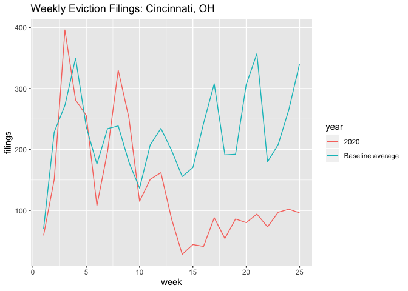<!-- -->

    ## 
    ## [[2]]

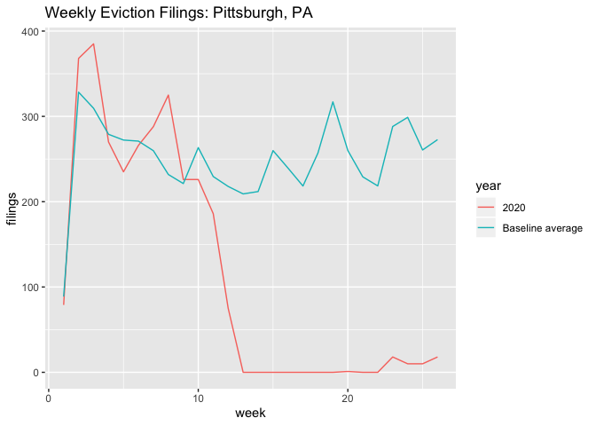<!-- -->

    ## 
    ## [[3]]

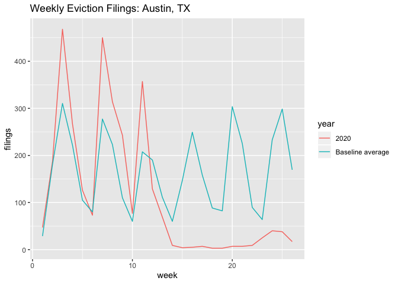<!-- -->

    ## 
    ## [[4]]

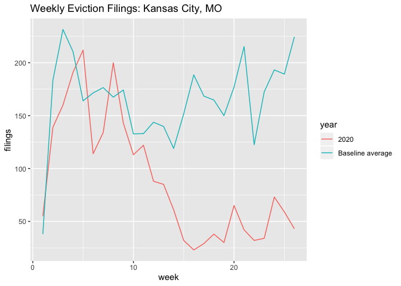<!-- -->

    ## 
    ## [[5]]

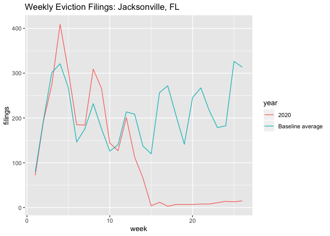<!-- -->

    ## 
    ## [[6]]

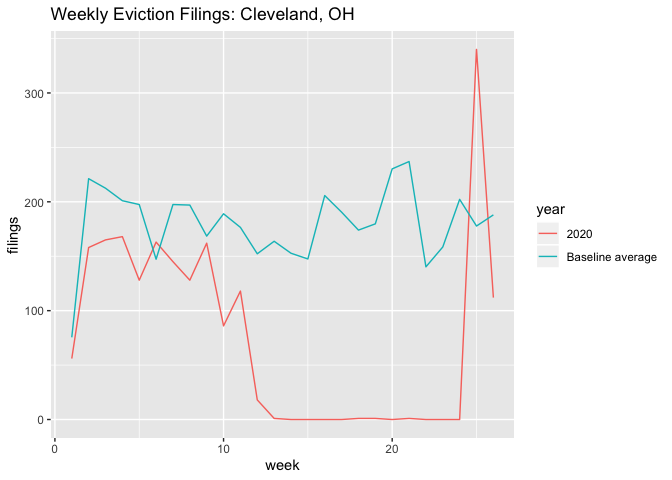<!-- -->

    ## 
    ## [[7]]

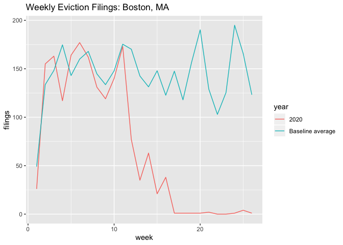<!-- -->

    ## 
    ## [[8]]

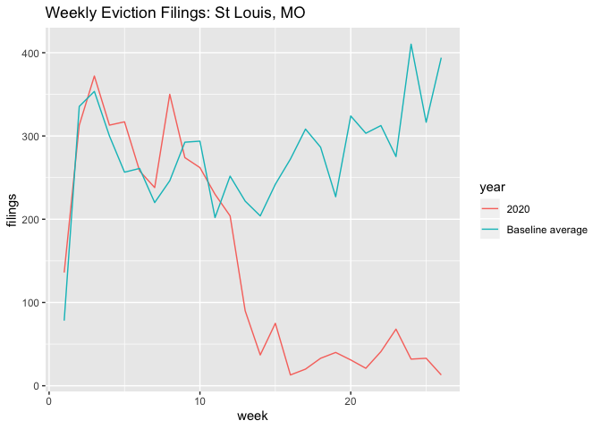<!-- -->

    ## 
    ## [[9]]

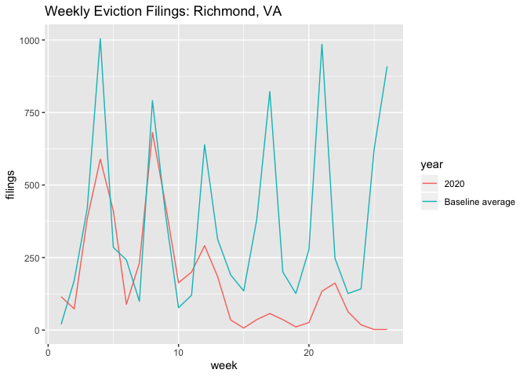<!-- -->

    ## 
    ## [[10]]

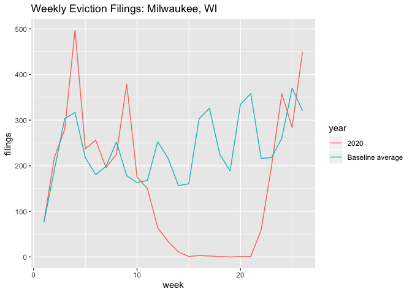<!-- -->

    ## 
    ## [[11]]

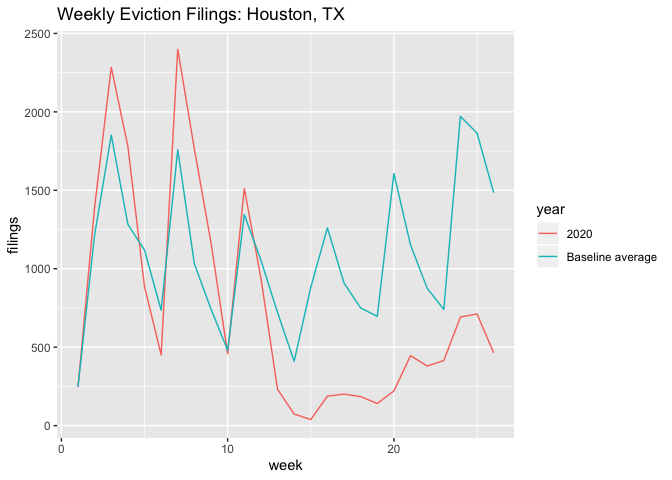<!-- -->

Some quick observations:

  - In most places, evictions remain low or at near-zero levels, most
    likely as a result of ongoing eviction moratoriums.
  - However, three cities run counter to this trend:
      - Houston, TX: There is a gentle uptick in eviction filings,
        though they remain below the average of previous years. This
        seems consistent with the fact that eviction protections in
        Texas started to expire on May 18, and that the courts in Harris
        and Galveston counties reopened in early June.
      - Milwaukee, WI: Eviction filings have spiked back to their
        average rate in recent years. As of the most-recent data, in
        fact, they appear to be above-average. This is to be expected,
        as state eviction protections began to expire on May 26.
      - Cleveland, OH: Eviciton filings spiked, but appear to have
        receded as of the most-recent week. This spike likely coincides
        with the lapsing of the Cleveland Municipal Housing Court
        moratorium on non-emergency evictions on June 15.
  - In short, at a glance, it seems that eviction moratioriums in these
    places have been effective in quashing evictions through the court
    system. (Of course, this data does not cover forced removals that
    happen outside of the courts, as when landlords kick out tenants by,
    say, removing their front doors.) Where eviction moratoriums have
    expired and court business has resumed, eviction filings
    subsequently increase.
